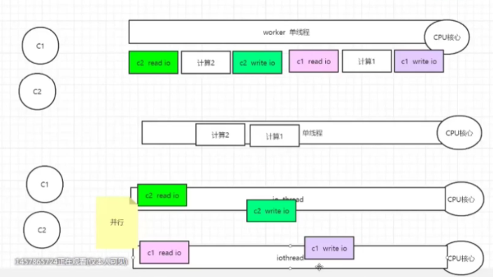

# Redis

https://www.bilibili.com/video/BV1oW411u75R?from=search&seid=17698457664264224122

https://www.bilibili.com/video/BV13z411b7mU?p=2

简介：

- 基于内存
- KV
- 每个工作worker线程是单线程
  - 大并发请求情况下，redis单线程读取请求和本地计算（串行化）
- 读写io线程多线程
- 支持大并发socket连接（epoll）：
- 本地计算
  - redis对value进行index increase等操作再返回给客户端
- 五中value类型
  - 相比只支持string的memcache，提供更多格式化数据，可以通过服务器本地计算提供数据某些字段，减小传输数据量、
  - value最大支持512M

- 串行化
  - 保证数据正确的情况下，避免加锁





## 5种类型

| String                                                       | List                                                         | Hash                                                         | Set                                                          | SortedSet                                                    |
| ------------------------------------------------------------ | ------------------------------------------------------------ | ------------------------------------------------------------ | ------------------------------------------------------------ | ------------------------------------------------------------ |
| **APPEND<br/>BITCOUNT<br/>BITOP<br/>DECR<br/>DECRBY<br/>GET<br/>**GETBIT<br/>GETRANGE<br/>GETSET<br/>**INCR<br/>INCRBY<br/>INCRBYFLOAT<br/>**MGET<br/>MSET<br/>MSETNX<br/>PSETEX<br/>**SET<br/>SETBIT<br/>**SETEX<br/>SETNX<br/>SETRANGE<br/>**STRLEN** | BLPOP<br/>BRPOP<br/>BRPOPLPUSH<br/>**LINDEX<br/>**LINSERT<br/>LLEN<br/>**LPOP<br/>LPUSH<br/>**LPUSHX<br/>**LRANGE<br/>**LREM<br/>LSET<br/>**LTRIM<br/>RPOP<br/>**RPOPLPUSH<br/>**RPUSH<br/>**RPUSHX | HDEL<br/>HEXISTS<br/>**HGET<br/>**HGETALL<br/>HINCRBY<br/>HINCRBYFLOAT<br/>**HKEYS<br/>**HLEN<br/>HMGET<br/>HMSET<br/>**HSET<br/>**HSETNX<br/>**HVALS<br/>**HSCAN | **SADD<br/>**SCARD<br/>**SDIFF<br/>**SDIFFSTORE<br/>**SINTER<br/>**SINTERSTORE<br/>SISMEMBER<br/>**SMEMBERS<br/>**SMOVE<br/>**SPOP<br/>SRANDMEMBER<br/>**SREM<br/>**SUNION<br/>**SUNIONSTORE<br/>SSCAN | **ZADD<br/>**ZCARD<br/>ZCOUNT<br/>ZINCRBY<br/>**ZRANGE<br/>ZRANGEBYSCORE<br/>**ZRANK<br/>ZREM<br/>ZREMRANGEBYRANK<br/>ZREMRANGEBYSCORE<br/>**ZREVRANGE<br/>ZREVRANGEBYSCORE<br/>**ZREVRANK<br/>ZSCORE<br/>ZUNIONSTORE<br/>ZINTERSTORE<br/>ZSCAN |

https://www.bilibili.com/video/BV1oW411u75R?p=11

### String

https://www.bilibili.com/video/BV13z411b7mU?p=3

**简介**：以字节数组来存储数据保证二进制安全

**场景**：session共享，kv存储，数值计算，fs小文件系统

**字符串**：字符串追加，求长度（B）操作

**数值**：数值加减 

**二进制位**：


### List

https://www.bilibili.com/video/BV13z411b7mU?p=4

**简介**：双向链表，key有指向头尾的指针，可以实现队列、栈、数组

**场景**：评论列表，消息队列，替代


### Hash

https://www.bilibili.com/video/BV13z411b7mU?p=4

**简介**：value也是哈希表，value内可以有多个字段，value{name：sean，age：18}

**场景**：聚集数据，表单详情页，用户详情，多读少写不需要十分精确的数据


### Set

https://www.bilibili.com/video/BV13z411b7mU?p=4

**简介**：value为NULL，key不重复的哈希表；无序、不重复、集合；不推荐使用

**场景**：共同好友，好友推荐


### Sorted Set(ZSet)

https://www.bilibili.com/video/BV13z411b7mU?p=5

**简介**：数据小压缩表，数据大切跳表，有序集合，带分值（score），分值相同按字典序排序

**场景**：排行榜，评论顺序（时间，评论数）


## 持久化

https://www.bilibili.com/video/BV13z411b7mU?p=7

### 快照 Redis Database

​	简介：默认开启RDB快照，dump.rdb文件

​	缺点：备份间隔越长，丢失数据量越大

### 日志 Append Only File

​	简介：默认不开启AOF日志，开启之后，redis重启只会读取AOF日志

​	缺点：日志中有很多无效数据

​	低版本：重写AOF，删除无效数据

### 混合持久化

​	简介：快照+日志


## 配置redis.conf

### Units

简介：配置大小单位，定义基本度量单位，只支持Byte，不支持bit，对大小写不敏感

```
1k 1kb 1m 1mb 1g 1gb
```


### Includes

简介：包含的其他配置文件


### General

daemonize：开启守护进程，默认NO不开启，退出redis命令行exit或断开连接则杀死进程，开启后必须手动kill；

pidfile：开启守护进程后，redis pid会写入该文件中

port：6379 redis端口号

tcp-backlog：设置tcp的backlog大小，backlog为tcp的连接队列

bind：绑定的网卡ip，默认监听本地所有网卡的ip

timeout：无操作多少秒后断开连接

tcp-keepalive：tcp-keepalive检测间隔

loglevel：日志级别debug **verbose** notice warning

logfile：日志名，空表示标准输出，

syslog-enabled：系统日志

syslog-ident：系统日志标识符

syslog-facility：系统日志输出设备，默认local0

databases：数据库个数，默认16个 select 0-15


### Snapshotting

**RDB**

save：<second> <changes> 如果在seconds内出现了changes次的修改，则快照 e.g. save 900 1 900s内有一次修改则快照 **1min1W次、5min10次、15min1次**

dbfilename： dump.rdb

stop-write-on-bgsave-error: 后台snapshot失败停止前台写入

rdbcompression:默认yes 压缩

rdbchecksum：rdb校验，增加10%性能消耗

dir：通过config get dir获得


**AOF**

appendonly：默认no不开启

appendfilename：默认“appendonly.aof"

appendfsync：always：同步持久化 / Everysec：默认，每秒记录 / No：不

**Rewrite**：日志超过阈值，进行rewrite精简日志，默认是aof文件是上次一倍且大小大于64M时触发rewrite

No-appendfsync-on-rewrite：重写的时候是否写日志，默认No

auto-aof-rewrite-percentage:100

auto-aof-rewrite-min-size:64mb


### Replication

 


### Security


### Limits

Maxclient：默认10000

Maxmemory：

Maxmemory-policy：缓存淘汰策略

​	volatile-lru：对设置了淘汰时间的key使用lru淘汰

​	allkeys-lru：lru淘汰

​	volatile-random：对设置了淘汰时间的key使用random淘汰

​	allkeys-random：随机淘汰

​	volatile-ttl：淘汰ttl值最小的key

​	noeviction：默认，不淘汰

Maxmemory-samples：设置样本数量，默认5个


##  事务

https://www.bilibili.com/video/BV1oW411u75R?p=20

简介：本质是一组命令的集合，一个事务中所有命令都会串行化执行

```
MULTI：标记事务的开始
EXEC：执行事务内的命令
DISCARD：取消事务
UNWATCH：取消watch铭记对所有key的监视；
WATCH：监视一个或多个key，如果在事务执行之前这个key被其他命令改动，事务将中断；

正常执行
放弃事务
全体连坐（入队失败集体失败）
冤头债主（入队成功执行失败单条命令失败）
watch监控（乐观锁，确保操作过程没有其他人修改该key）
```


**悲观锁**：每次拿数据都加锁（表锁，行锁，列锁），传统数据库常用

**乐观锁**：每次拿数据不加锁，在更新的时候会判断是否有别人修改此数据（版本号机制），适用于多读的系统，提高吞吐量


单独的隔离操作

没有隔离级别的概念

不保证原子性（冤头债主）


## 发布订阅

```
SUBSCRIBE c1 c2 订阅
PSUBSCRIBE new* 通配符订阅 
PUBLISH c1 helloworld 发布
```


## 主从复制（master/slave）

https://www.bilibili.com/video/BV1oW411u75R?p=22

简介：主从复制，主机更新数据后自动同步到备机，master以写为主，slave以读为主；

```
// 配slave不配master，配置到redis.conf文件中重启后关系还生效
slaveof master_ip master_port
slaveof no one 翻身农奴做主人
```


场景：读写分离，容灾


一主二仆：

薪火相传：

反客为主：


#### 哨兵模式（sentinel）

简介：监控master是否故障，自动将slave转换为master

```
sentinel.conf配置文件
sentinel monitor host6379 			127.0.0.1 6379 		1
//				 被监控master的名字	被监控ip	被监控port  至少需要多少个sentinel同意才能迁移
```


## API接口

​	端口号：6379

