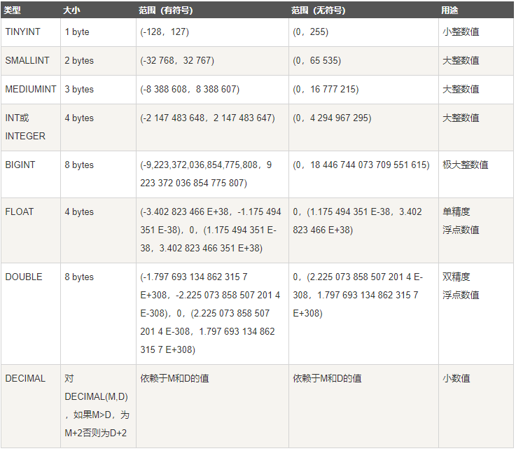

# MySQL


## 终端使用

https://www.bilibili.com/video/BV1Vt411z7wy?p=3

### 登录/退出

```mysql
mysql -uadmin -pHuawei@123;
exit;
```


### 数据库

#### 查看

```mysql
show database;
```

#### 创建

```mysql
create database mydb;
```

#### 选中

```mysql
use mydb;
```


### 表

#### 查看所有表

```mysql
show tables;
```

#### 创建

```mysql
create table pet (
	name VARCHAR(20),
	owner VARCHAR(20),
	species VARVHAR(20),
	sex	CHAR(1),
	birth DATE,
	death DATE,
	);
```

#### 查看

```mysql
describe pet;
```

#### 修改

```mysql
alter table pet add/drop/modify name VARCHAR(40);
```


### 记录

#### 插入

```mysql
insert into pet values ('Puffball','Diane','hamster','f','1999-03-03',NULL);
insert into pet values ('旺财','周星星','狗','公','1999-03-03',NULL);
```

#### 查询

```mysql
select * from table where owner='周星星';
```

#### 删除

```mysql
delete from pet where owner='周星星';
```

#### 修改数据

```mysql
update pet set owner='周星驰' where name='旺财';
```


> #### MySQL数据类型有哪些？
>
> https://www.runoob.com/mysql/mysql-data-types.html
>
> 
>
> **数值：按照大小选**
>
> 
>
> 
>
> **日期：按照格式选**
>
> 
>
> 
>
> **字符串：按照格式选**
>
> 


## 约束

https://www.bilibili.com/video/BV1Vt411z7wy?p=8

### 主键约束

简介：能够唯一确定表中的一条记录，不重复且不为空。

```mysql
create table user(
	id int primary key,
	nme VARCHAR(20)
);

insert into user values(1,'张三'); // 前面的id必须有，不能为NULL
```

```mysql
create table user2(
	id int,
	name varchar(20),
	password varchar(20),
	primary key(id, name) // 联合主键，多个字段组成主键
);

insert into user2 values(1,'张三');
insert into user2 values(2,'张三');
insert into user2 values(1,'李四')；
```


### 自增约束

简介：自动递增主键的值

```mysql
create table user3(
	id int primary key auto_increment,
    name varchar(20)
);

insert into user3 (name) values('张三');
```

> #### 创建表的时候忘记设置主键？
>
> ```mysql
> alter table user4 add primary key(id);
> alter table user4 drop primary key;
> alter table user4 modify id int primary key;
> ```


### 唯一约束

简介：约束字段的值不能重复

```mysql
create table user5(
	id int,
	name varchar(20)
);

alter table user5 add unique(name);

create table user6(
	id int,
	name varchar(20),
    unique(name)
);

create table user7(
	id int,
	name varchar(20) unique
);

create table user7(
	id int,
	name varchar(20),
    unique(id, name) // 组合起来不能重复
);

alter table user7 drop index name; // 删除唯一约束
alter table user7 modify name varchar(20) unique; // 添加唯一约束
```


### 非空约束

简介：修饰的字段不能为空

```mysql
create table user9(
	id int,
	name varchar(20) not null
);
```


### 默认约束

简介：插入字段没有传值，会自动使用默认值

```mysql
create table user10(
	id int,
    name varchar(20),
    age int default 10
);
```


### 外键约束

简介：约束**副/子表A**中的字段a必须来自**主/父表B**的字段b

```mysql

create table classes(
	id int primary key auto_increment,
    name varchar(20)
);

create table student(
	id int primary key auto_increment,
    name varchar(20),
    class_id int,
    foreign key(class_id) references classes(id) //
);

insert into classes value('一班');
insert into classes value('二班');
insert into classes value('三班');

insert into student values('张三','三班') // '四班'则报错
```


## 范式

https://www.bilibili.com/video/BV1Vt411z7wy?p=16

### 第一范式（字段原子性）

简介：数据表中所有字段都是不可分割的原子值，字段越详细，不一定越好，需要查找拼接的字段越多，以实际需求为主设计

```mysql
// 不满足第一范式
create table student2(
	id int primary key,
    name varchar(20),
    address varchar(30)
);

insert into student2 values(1, '张三','中国四川省成都市武侯区武侯大道100号');
insert into student2 values(2, '李四 ','中国四川省成都市武侯区武侯大道200号');
insert into student2 values(3, '王五','中国四川省成都市武侯区武侯大道300号');

// 满足第一范式
create table student3(
	id int primary key,
    name varchar(20),
    country varchar(20),
    province varchar(20),
    city varchar(20),
    detail varchar(20)
);
```


### 第二范式（消除部分依赖）

简介：满足第一范式的前提下，除主键外的每一列都必须完全依赖于主键，通过拆表来解决

```mysql
// 不满足第二范式
create table myorder(
	product_id int,
    customer_id int,
    product_name varchar(20),
    customer_name varchar(20),
    primary key(product_id, customer_id) // product_name只依赖product_id customer_name只依赖于customer_id
);

// 拆分后满足第二范式
create table myorder(
    order_id int primary key,
	product_id int,
    customer_id int,
);
create table product(
    id int primary key,
	name varchar(20)
);
create table customer(
    id int primary key,
	name varchar(20)
);
```


### 第三范式（消除传递依赖）

简介：满足第二范式前提下，除主键之外的字段不能有传递依赖

```mysql
// 不满足第三范式
create table myorder(
    order_id int primary key,
	product_id int,
    customer_id int,
    customer_phone varchar(15) // order_id找到customer_id找到customer_phone,该字段需要放入customer表中，才满足
);
```


## 查询练习

https://www.bilibili.com/video/BV1Vt411z7wy?p=20

1. 查询student表中所有记录

   ```mysql
   select * from student;
   ```

   

2. 查询student表中的所有记录的snane，ssex，class字段/列（查询**部分字段**）

   ```mysql
   select sname, ssem, class from student;
   ```

   

3. 查询教师所有单位，即不重复的department字段（**字段去重distinct**）

   ```mysql
   select depart from teacher; // 相同记录有多条
   select distinct depart from teacher; // 字段去除重复
   ```

   

4. 查询score表中成绩在60到80之间的所有记录 （字段**区间查询 between and  >  <**）

   ```mysql
   select * from score where degree between 60 and 80;
   select * from score where degree > 60 and degree < 80;
   ```

   

5. 查询score表中成绩为85，86或者88的记录（表示**或**的查询 **in**）

   ```mysql
   select * from score where degree in(85, 86, 88);
   ```

   

6. 查询student表中“95031”班或性别为“女”的同学记录（表示**或**的查询 **or**）

   ```mysql
   select * from student where class='95031' or ssex=' 女';
   ```

   

7. 以class降序查询student表的所有记录 ( **排序order by**, 降序desc)

   ```mysql
   select * from student order by class desc;
   ```

   

8. 以cno升序、degree降序插叙score表的所有记录（**先升序asc后降序desc**）

   ```mysql
   select * from score order by cno asc, degree desc;
   ```

   

9. 查询“95031”班的学生人数（**统计记录数量count**）

   ```mysql
   select * from student where class='95031'; // 筛选后的所有记录；
   select count(*) from student where class='95031'; // 筛选后的所有记录的数量
   ```

   

10. 查询score表中的最高分的学生号和课程号（**子查询**或者排序并**limit**）

    ```mysql
    select sno, cno from score where degree=(select max(degree) from score); // 子查询找最高
    
    select sno, cno from score order by degree desc limit 0, 1 // 排序并limit找最高
    ```

    

11. 查询每门课程的平均成绩（**分组group by**求**字段平均值avg**）

    ```mysql
    select * from course;
    select avg(degree) from score where cno = ’3-105‘;
    select avg(degree) from score where cno = ’3-106‘;
    select avg(degree) from score where cno = ’3-107‘;
    ......
    
    // 合成一个语句
    select cno, avg(degree) from score group by cno;
    ```

    

12. 查询score表中至少有2名学生选修的并以3开头的课程平均分（**分组group by**后**过滤条件having**，**模糊匹配like**）

    ```mysql
    查分
    select * from score；
    查课程分
    select cno degree from score;
    查询课程平均分
    select cno avg(degree) from score group by cno;
    查询至少有2名学生选修的课程平均分
    select cno degree(avg) from score group by cno having count(cno)>=2;
    查询至少有2名学生选修并且课程号3开头的的课程平均分
    select cno degree(avg) from score group by cno having count(cno)>=2 and cno like '3%';
    ```

    

13. 查询分数大于70，小于90的sno列

    ```mysql
    select sno from score where degree between 70 and 90; 
    ```

    

14. 查询所有学生的sname，cno和degree（**多表查询**）

    ```mysql
    // 跨student和score表查询
    select sname from student;
    select cno, degree from score;
    
    // 找到共有字段sno
    select sno, sname from student;
    select sno, cno, degree from score;
    
    select sname, cno, degree from student,score
    where student.sno=score.sno;
    ```

    

15. 查询所有学生的sno，cname和degree（**多表查询**）

    ```mysql
    select sno, cname, degree from score, course
    where score.cno=course.cno;
    ```

    

16. 查询所有学生的sname，cname和degree（多表查询）

    ```mysql
    // student和class互相没有直接联系 通过 score关联起来
    select sname, cname, degree from student, course, score
    where student.sno = score.sno and course.cno = score.cno
    ```

    

17. 查询’95031‘班学生每门课的平均分

    ```mysql
    // 查询班里所有学生的成绩
    select * from
    score
    where sno in (select sno from student where class='95031');
    
    // 查询班里所有学生成绩的平均分
    select cno, sno, avg(degree)
    from score
    where sno in (select sno from student where class='95031')
    group by cno;
    ```

    

18. 查询选修“3-105”课程的同学中成绩高于“109”号同学成绩的所有同学记录

    ```mysql
    // 109号同学“3-105”课程成绩
    select degree
    from score
    where sno='109' and cno='3-105';
    
    // 大于该成绩的“3-105”课程同学的成绩
    select *
    from score
    where cno='3-105' and degree > (select degree from score where sno='109' and cno='3-105') 
    ```

    

19. 查询成绩高于学号为“109”、课程号为“3-105”的所有人以及课程的成绩

    ```mysql
    // 学号109，课程“3-105”的成绩
    select degree
    from score
    where sno='109' and cno='3-105';
    
    // select degree
    from score
    where degree > (select degree from score where sno='109' and cno='3-105');
    ```

    

20. 查询和学号为108,101的同学同年出生的所有学生的sno，sname和sbirthday

    ```mysql
    // 学号108,101同学出生年
    select year(sbirthday) from student where sno in (101,108);
    
    // 完整查询
    select sno, sname, sbirthday from student
    where year(sbirthday) in (select year(sbirthday) from student where sno in (101,108));
    ```

    

21. 查找“tom”教师任课的学生成绩

    ```mysql
    // 老师的tno
    select tno from teacher where tname='tom';
    
    // 这门课的cno
    select cno from course where tno=(select tno from teacher where tname='tom');
    
    // 这门课的成绩
    select * from score where cno=(select cno from course where tno=(select tno from teacher where tname='tom'))
    ```

    

22. 查询选修某课程的同学人数多于2人的教师姓名

    ```mysql
    // 人数大于2的课程cno
    select cno from score group by cno having count(*)>2;
    // 该课程的老师tno
    select tno from course where cno in (select cno from score group by cno having count(*)>2);
    // 该tno的老师姓名
    select tname from teacher where tno in (...)
    ```

    

23. 查找95033和95031班全体学生的记录

    ```mysql
    select * from student where class in ('95031', '95033');
    ```

    

24. 查询存在有85分以上成绩的课程cno

    ```mysql
    select cno, max(degree) from score group by cno having degree>85; 
    ```

    

25. 查询出计算机系教师所教课程的成绩

    ```mysql
    // tno
    select tno from teacher where depart='计算机系'；
    // cno
    select cno from course where tno in (...);
    // score
    select * from score where cno in (...);
    ```

    

26. 查询 计算机系与电子工程系 不同职称的教师的tname和prof（**查询结果做union，得到并集**）

    ```mysql
    // 电子工程系的职称
    select prof from teacher where depart='电子工程系';
    // 不在这些职称里的计算机老师
    select tno, name from teacher where depart="计算机系" and prof not in(...);
    
    // 计算机系的职称
    select prof from teacher where depart='计算机系';
    // 不在这些职称里的电子工程系老师
    select tno, name from teacher where depart="电子工程系" and prof not in(...);
    
    // union得出最终结果
    2 union 4
    ```

    

27. 查询选修编号为“3-105”课程且成绩**至少高于**选修编号“3-245”的同学的cno，sno和degree，并且按照degree从高到低排序( 大于**任意一个any**)

    ```mysql
    select degree from score where cno = '3-245';
    
    select * from score where cno = '3-105';
    
    select cno, sno, degree from score where cno='3-105' and degree > any(...) order by degree desc;
    ```

    

28. 查询选修编号为“3-105”**且成绩高于**选修编号为“3-245”的课程的同学的cno，sno，degree（大于**所有all**）

    ```mysql
    select degree from score where cno = '3-245';
    
    select * from score where cno = '3-105';
    
    select cno, sno, degree from score where cno='3-105' and degree > all(...) order by degree desc;
    ```

    

29. 查询所有教师和同学的name、sex、birthday(union结果后做**别名as**)

    ```mysql
    select tname as name, tsex as sex, tbirthday as birth from teacher;
    union
    select sname, ssex, sbirthday from student;
    ```

    

30. 查询所有女教师和女同学的name sex birthday

    ```mysql
    select tname as name, tsex as sex, tbirthday as birth from teacher where tsex='女';
    union
    select sname, ssex, sbirthday from student where ssex='女';
    ```

    

31. 查询成绩比该课程平均成绩低的同学的成绩表

    ```mysql
     select cno， avg(degree) from score group by cno;
     select * from score a where degree < (select avg(degree) from score b where a.cno=b.cno);
    ```

    

32. 查询所有任课教师的tname和depart

    ```mysql
    select * from teacher;
    select * from course;
    
    select tname,depart from teacher where tno in (select tno from course);
    ```

    

33. 查询至少有2名男生的班号

    ```mysql
    select class from student where ssex='男' group by class having count(*)>1;
    ```

    

34. 查询student表中不姓王的同学记录

    ```mysql
    select * from student where sname not like('王%');
    ```

    

35. 查询student表中每个学生的姓名和年龄（**时间的计算year(now)**）

    ```mysql
    select sname, year(now)-year(sbirthday) as age from student;
    ```

    

36. 查询student表中最大和最小的sbirthday日期

    ```mysql
    select max(sbirthday) as max_age, min(sbirthday) as min_age from student order by sbirthday;
    ```

    

37. 以班号和年龄从大到小的顺序查询student表中的全部记录

    ```mysql
    select * from student order by class desc, sbirthday;
    ```

    

38. 查询男教师及其所上的课

    ```mysql
    select tno from teacher where tsex='男';
    select * from course where tno in (select tno from teacher where  tsex='男');
    ```

    

39. 查询最高分同学的sno cno 和degree

    ```mysql
    select max(degree) from score;
    select * from score where degree in (select max(degree) from score);
    ```

    

40. 查询和李军同性别的所有同学的sname

    ```mysql
    select ssex from student where sname='李军';
    select sname from student where ssex in (select ssex from student where sname='李军');
    ```

    

41. 查询和李军同学同性别并同班的同学；

    ```mysql
    select sname from student where ssex in (select ssex from student where sname='李军') and class in (select class from student where sname='李军');
    ```

    

42.  查询所有选修“计算机导论”课程的“男”同学的成绩

    ```mysql
    select sno from student where ssex='男';
    select cno from course where cname='计算机导论';
    select * 
    from score 
    where cno in (...) and sno in (...);  
    ```

    

## 连接查询

### 内连接 join

简介：仅仅会把左右表字段匹配的记录查询出来

```mysql
select * from person join card on person.cardId=card.id;
```


### 左外连接 left join

简介：会把左边表里所有数据显示出来， 而右边表中的数据，如果有相等则显示，不相等则右表字段补NULL显示

```mysql
select * from person left join card on person.cardId=card.id;
```


### 右外连接 right join

简介：会把右边表里所有数据显示出来， 而左边表中的数据，如果有相等则显示，不相等则左表字段补NULL显示

```mysql
select * from person right join card on person.cardId=card.id;
```


### 全外连接 full join

简介：会把左右表所有记录查询出来，字段不匹配的记录补NULL，mysql不支持

```mysql
select * from person full join card on person.cardId=card.id;
= 左连接union右连接

```


## 事务

https://www.bilibili.com/video/BV1Vt411z7wy?p=58

简介：多条sql语句，要么同时成功，要么同时失败，mysql默认是开启事务的（自动提交）

### 自动提交

```mysql
select @@autocommit; // 查看autocommit状态

set autocommit=0; // 关闭autocommit状态，需要手动commit
```


### 手动提交

```mysql
begin; / start transaction;
update a;
update b;
commit; // 两条sql一个事务
rollback; // 可以回滚未commit的sql，commit之后无法rollback

```


### ACID特性

```mysql
A 原子性：事务是最小的单位，不可分割；
B 一致性：同一事务的sql同时生效或失败；
I 隔离性：事务a和事务b相互隔离；
D 持久性：事务一旦commit成功，则不能回退；
```


### 事务的隔离性

#### 隔离级别

```mysql
mysql 8.0
select @@global.transaction_isolation; // 系统级别
select @@transaction_isolation; // 会话级别

mysql 5.X
select @@global.tx_isolation; // 系统级别
select @@tx_isolation; // 会话级别

set global transaction isolation level read committed; // 设置系统隔离级别
set transaction isolation level read committed; // 设置会话隔离级别
```


```mysql
// 隔离级别
read uncommitted;	读未提交的
	事务a可以看到其他事务中未commit的修改，脏读
read committed;		读已经提交的
	事务a只可以看到其他事务中已commit的修改
repeatable read;	事务中可以重复读，读出数据一致
	事务a对表1的操作的时候（读写），事务b可以读写表1
	事务a查询，事务b修改提交，事务a再处理记录，这时a处理的是新数据并非a当时读的数据，幻读
serializable;		串行化
	事务a对表1的操作的时候（读写），事务b无法读写表1，直到事务a提交之后


```

